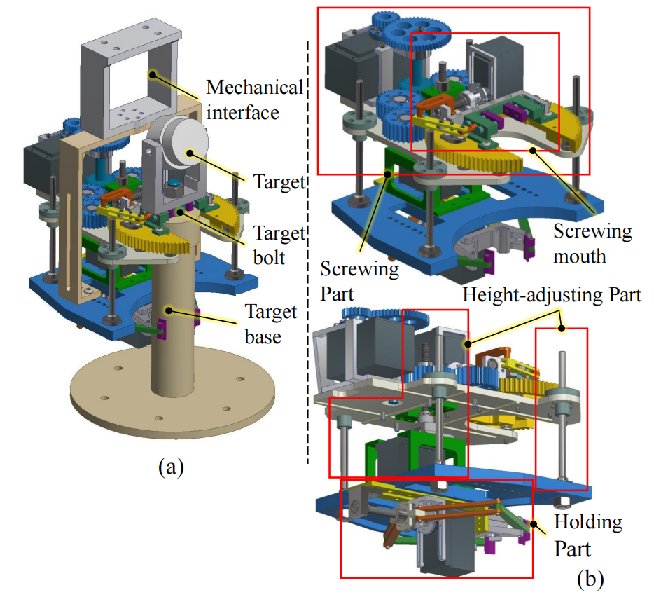
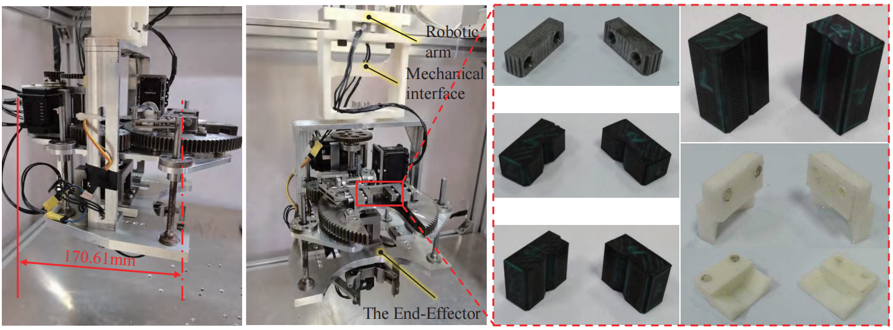

## Short Bio
I am a fourth-year Ph.D. student in control theory and control engineering with the State Key Laboratory of Multimodal Artificial Intelligence Systems, Institute of Automation, Chinese Academy of Sciences(CASIA). I received B.E. from Wuhan university of Technology in mechanical engineering.

## Research
My major reasearch interests lies in robotic manipulation, which includes intelligent assembly, contact-righ manipulation, and reinforcement learning. Specificlly, the research project are presented as follows:

<!-- ## Publications -->
### Development of Prism Target Maintenance Robotic System

    
 
        
        
    

### Methods of Robotic Screwing Operation

## Awards

